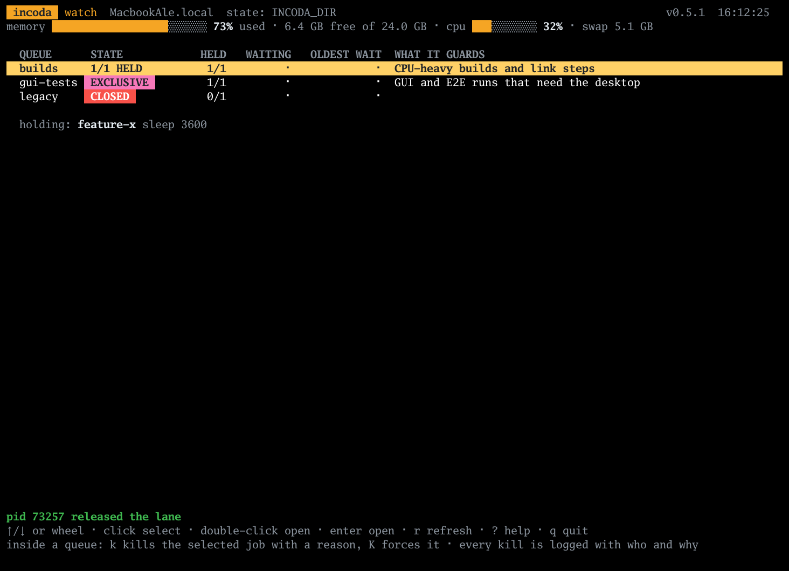
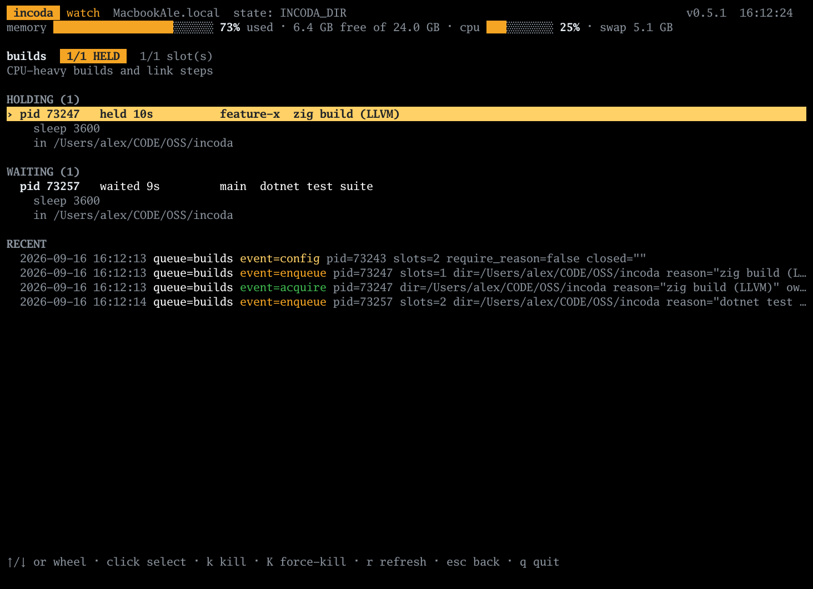
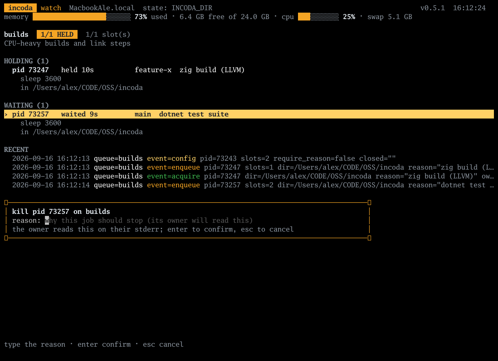
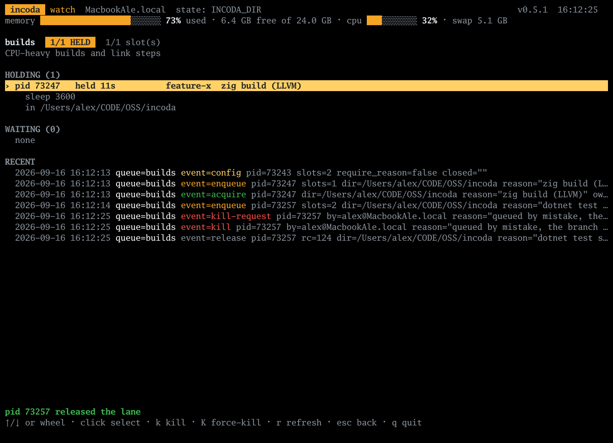

# incoda

### Power is nothing without control.

**Machine-local FIFO job queue with OS file locks** — serialize builds, tests, and
AI-agent workloads on one machine. One static Go binary, no daemon.

[](https://github.com/deblasis/incoda/releases)
[](https://github.com/deblasis/incoda/actions/workflows/ci.yml)
macOS · Linux · Windows · amd64/arm64

## Contents

- [Quick start](#quick-start)
- [Install](#install)
- [Why](#why)
- [Use cases](#use-cases)
- [Watch](#watch)
- [How it works](#how-it-works)
- [Commands](#commands)
- [AI agents](#ai-agents)
- [Alternatives](#alternatives)
- [Limits](#limits)
- [Design](#design)



## Quick start

```bash
brew install deblasis/tap/incoda   # or see Install below

incoda run --queue builds --reason "my build" -- make -j8
incoda status --queue builds       # who holds it, who waits
incoda watch                       # live dashboard of every queue
```

Same `--queue` key from any directory or git worktree. Or run
[`examples/demo.sh`](examples/demo.sh) for a 30-second tour.


*FIFO in the terminal: `incoda run --queue builds` serialises heavy jobs; the lane
hands over when the holder exits (even under `kill -9`).*

## Install

macOS (Homebrew):

```bash
brew install deblasis/tap/incoda
```

Windows (Scoop):

```powershell
scoop bucket add deblasis https://github.com/deblasis/scoop-bucket
scoop install deblasis/incoda
```

macOS and Linux (install script):

```bash
curl -fsSL https://raw.githubusercontent.com/deblasis/incoda/main/install.sh | sh
```

Windows (PowerShell install script):

```powershell
irm https://raw.githubusercontent.com/deblasis/incoda/main/install.ps1 | iex
```

The scripts detect OS and architecture, download the matching release asset,
verify its SHA-256 against `SHA256SUMS`, and install to `~/.local/bin` or
`%LOCALAPPDATA%\Programs\incoda`. They refuse to install anything they could
not verify. If `incoda` is not found after the script, add `~/.local/bin` to
your `PATH`.

Or with Go 1.27+:

```bash
go install github.com/deblasis/incoda@latest
```

Prebuilt binaries for `windows/amd64`, `windows/arm64`, `darwin/arm64`,
`darwin/amd64`, `linux/amd64` and `linux/arm64` are on the
[Releases page](https://github.com/deblasis/incoda/releases).

## Why

Parallel AI agent sessions on one machine all decide to build, test and lint at
once. Six worktrees, six heavy jobs — swap exhaustion, watchdog panic, or GUI
tests fighting over focus until both fail like product bugs. The fix is not
more RAM. It is making the collision impossible: heavy jobs go through one
lane, so they cannot overlap.

The same shape shows up wherever two jobs fight over a resource: GUI/E2E runs
that need the desktop to themselves, builds that share one cache directory,
anything driving a device. `incoda` is for anything that needs the machine, or
some part of it, to be quiet.

## Use cases

- **AI agent fleets.** A dozen agent sessions in parallel all want to build,
  test and lint at once. Give each session the same `--queue` key and the heavy
  work serialises instead of colliding. Works across git worktrees: nothing is
  keyed to a working directory.
- **GUI and E2E test runs.** Two at once fight over focus, the foreground
  window and synthesized input. A `gui-tests` queue gives each run the desktop
  to itself.
- **`--slots N` for resources that are not exclusive.** Two CPU-heavy linters at
  a time, no more. Participants that disagree about N settle on the minimum.
- **Shared workstations and self-hosted runners.** One Mac mini serving several
  people, agents or CI jobs: same key, orderly queue, full visibility of who is
  holding it from where.
- **Agent compliance by convention.** Ships with a rule block
  ([`AGENT-RULE.md`](AGENT-RULE.md)) for `CLAUDE.md` / `AGENTS.md`, so agents
  route heavy commands through the lane without being told each time.

## Watch

`incoda watch` is the live screen: one row per queue with state (`FREE`,
`1/2 HELD`, `EXCLUSIVE`, `CLOSED`), holders, waiters, oldest wait, and the
memory gauge. Enter opens a queue — pid, owner, reason, command, directory,
recent events. `k` kills with a reason (same as `incoda kill`); `K` forces.
Mouse: click to select, double-click to open, wheel to move.







Re-record: `./docs/demo/record-watch.sh` (needs
[ttyrig](https://github.com/deblasis/ttyrig)) or `./docs/demo/record-cli-demo.sh`
for the CLI GIF.

## How it works

**Keys.** A queue is a name. `--queue builds` and `--queue gui-tests` never
block each other. There is no default key: an unkeyed `run` is refused, because
two unrelated projects silently sharing one lane is exactly the failure this
tool prevents.

**Slots.** Each queue has a slot count, default 1: plain mutual exclusion.
`incoda config builds --slots 2` lets two holders run at once; `--slots` on a
run can narrow it, not widen it. `--exclusive` asks for the queue alone.
`--queue a,b` holds several queues for one command, taken in sorted order so
two such runs can never deadlock each other.

**FIFO, really.** Ticket filenames encode arrival order; a later arrival cannot
overtake an earlier one. Waiters poll instead of waiting on a signal — up to one
poll interval (500 ms default) of handoff latency, nothing goes stale.

**The kernel holds the lock.** Every participant holds an OS-level exclusive
lock on its ticket file: `flock` on Unix, `LockFileEx` on Windows. The kernel
releases it when the process ends for any reason, including `SIGKILL`. Stale
tickets are reaped by trying to lock them; there is no pid file to lie.

**Machine-local and per-user, never per-directory.** `incoda run --queue builds`
contends for the same lane from any folder, worktree or drive letter. State lives
in one place per user (`%LOCALAPPDATA%\incoda` on Windows,
`~/Library/Application Support/incoda` on macOS, `$XDG_STATE_HOME/incoda` on
Linux).

Queue config (description, `--require-reason`, close/replace keys), nested runs
via `INCODA_HELD`, and `lane.log` accounting are documented in
[`docs/DESIGN.md`](docs/DESIGN.md).

## Commands

| Command | What it does |
|---|---|
| `incoda run --queue KEY[,KEY...] [--slots N] [--exclusive] [--wait DUR] [--reason TEXT] [--owner WHO] -- <cmd...>` | Acquire, run, release. `--wait` default `30m`; `0` fails fast. `--owner` (or `INCODA_OWNER`) names the session or worktree. |
| `incoda watch [--queue KEY] [--interval 2s] [--once \| --plain]` | Live dashboard, or plain `status` text on a pipe. |
| `incoda status [--queue KEY] [--all] [--json]` | Holders and waiters in arrival order. `--json` is a stable schema for scripts. |
| `incoda config KEY [--slots N] [--description TEXT] [--require-reason] [--close MSG \| --open]` | Standing queue configuration. |
| `incoda kill --queue KEY --pid N --reason TEXT [--wait 5s] [--force]` | Ask a holder or waiter to stop; exits `124` when acknowledged. |
| `incoda queues` | Every queue with state on this machine. |
| `incoda force-release --queue KEY [--live]` | Delete tickets. Refuses while live participants exist unless `--live`. |
| `incoda doctor` | State directory, writability, locking probe. |

`run` passes the child's exit code through. Lane failures use a stable band:
`120` usage, `121` wait elapsed, `122` state unusable, `123` spawn failure,
`124` killed through the lane, `125` kill not acknowledged, `130` interrupted
while queueing. Signals forward to the child; on Windows the child runs inside a
Job Object with kill-on-close.

Full flag reference, exit codes, nested runs, and log format:
[`docs/DESIGN.md`](docs/DESIGN.md).

## AI agents

The tool works by convention: it binds only what is routed through it. Copy
[`AGENT-RULE.md`](AGENT-RULE.md) into `~/.claude/CLAUDE.md`, a repository's
`AGENTS.md`, or Cursor project rules — one paragraph listing which command
classes run under the lane, which key to use, and never to bypass it.

Set once per machine or session:

```bash
export INCODA_QUEUE=builds
export INCODA_OWNER="$(git branch --show-current 2>/dev/null || hostname)"
```

Wrap recipes the same way agents wrap one-off commands:

```bash
incoda run --queue builds --reason "just build" -- just build
```

## Alternatives

| They use… | incoda is… |
|---|---|
| Shell `flock` wrapper | Same primitive, plus FIFO ordering, multi-key acquire, `status`/`watch`/`kill`, crash-safe reaping |
| `make -j` / ninja | Per-target parallelism inside one build; incoda serialises *whole jobs* across sessions |
| Redis / Celery / SQS | Cross-machine, networked; incoda is machine-local by design |
| CI queue concurrency | Remote runner limits; incoda is for local boxes and self-hosted runners |
| Process mutex in app code | External CLI — wraps any command, no code changes, works across worktrees |

## Limits

**It serialises. It does not make an oversized single job fit.** If one job alone
drives the machine into swap or OOM, that job is too big for that machine.
`watch` shows a memory gauge; it is observability, not a governor.

**It is advisory.** No process-creation interception — by design. When the lane
makes you wait, that is the tool working; surface it, do not bypass it.

Not planned: cross-machine coordination, memory limits or cgroups, per-project
state directories, distributed locks.

- **Machine-local and per-user.** Two machines, or two OS users, never serialise
  each other. State must be on a local filesystem; `doctor` fails on network
  mounts that do not enforce locks.
- **Unix process trees can survive a hard kill of `incoda`.** Only Windows gets
  the Job Object kill-on-close guarantee.
- **`--slots` disagreement resolves to the minimum**, never revokes a running
  holder. `--exclusive` waits; it does not evict.
- **Multi-key runs hold early keys while waiting for later ones** — deadlock-free,
  but `a,b` can keep `a` busy while queuing on `b`.
- **Polling:** up to one interval of handoff latency; `lane.log` grows without
  bound (slowly).

Platform caveats, nested-run warnings, and the full locking protocol:
[`docs/DESIGN.md`](docs/DESIGN.md).

## Design

The full rationale (locking protocol, registry-lock window, ordering guarantees,
platform process-tree behaviour, state directory resolution) is in
[`docs/DESIGN.md`](docs/DESIGN.md).

## License

[MIT](LICENSE)
